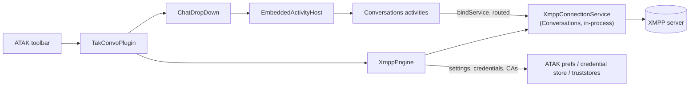

# TAK Convo

An ATAK plugin that embeds the [Conversations](https://codeberg.org/iNPUTmice/Conversations)
XMPP client in ATAK, the way Taktrix embeds Element: Conversations' own engine and screens,
running in ATAK's process, in ATAK panes, connected to the organisation's XMPP server with the
user's TAK identity.

- **XMPP in ATAK**: 1:1 chats and group chats (MUC), OMEMO encryption, file transfer
  (HTTP upload), reactions, search, history (MAM). The engine and UI are Conversations 2.20.4.
- **Zero typing**: the XMPP domain comes from a `.pref` file or mission package; the login
  reuses the TAK server's username and password. An XMPP login screen exists for other setups.
- **Trust like ATAK**: the server certificate is checked against the CAs of ATAK's TAK server
  truststores (optionally the device CA store, or a CA file), besides the public CAs.
- **TAK identity**: the device's XMPP address goes out in its SA (`<contact xmppUsername>`), as
  TAK Chat does.

## Status

2026-09-30. Working on a Samsung Galaxy S23 (Android 16) with the ATAK-CIV 5.5.1.8 developer
build, against an Openfire server:

| Works | Not yet |
|---|---|
| engine in-process, provisioning from `.pref`, TAK credentials or XMPP login | voice messages, calls (audio/video) |
| trust from TAK truststores / Android CA store / CA file | share or show a location (should become ATAK map integration) |
| account pane, tool preferences, `.pref` import | QR codes, profile pictures, backups |
| chat pane: chat list, chats, group chats, start chat, channel details, search | contacts integration: ATAK contacts ↔ XMPP chats, unread badges, GeoChat-like notifications |
| sending/receiving with OMEMO, reactions, context menus, text selection | re-selecting resources when the pane is resized or the device rotated |
| attachments: pick, upload, open with another app, camera | some Conversations screens are allowed but untested (see docs/04) |

Release ATAK (e.g. Play Store ATAK-CAN) loads only plugins signed by TAK.gov, so the plugin
runs on ATAK developer builds until it goes through TAK.gov signing.

## How it works

ATAK loads a plugin's code into its own process: none of the plugin's activities, services or
providers can run. TAK Convo gives Conversations what it expects anyway:

- **Engine**: `XmppConnectionService` and the `Application` are created as plain objects on an
  `EmbeddedContext` (ATAK's identity, the plugin's resources, storage namespaced in ATAK's data
  directory, `startService`/`bindService` routed to the in-process service).
- **Screens**: Conversations' real activities are created with `Instrumentation.newActivity`,
  driven through their lifecycle by the plugin, and their views moved into an ATAK drop-down.
  A stand-in parent activity catches `startActivity`/`finish` and keeps a back stack. Results,
  permissions, context menus and action modes are routed through ATAK's activity and window.
- **Fork**: 22 upstream files changed and one added, all marked `TAKCONVO`: no Android service,
  hooks for trust, compatibility with the libraries ATAK loads, activities in a pane, files
  through ATAK's FileProvider.



Details in [docs/](docs/README.md).

## Requirements

**Equipment.** Android 6.0+ (minSdk 23). Tested on a Samsung Galaxy S23 (Android 16) and an
Android 14 emulator.

**ATAK.** ATAK-CIV 5.5.x developer build (the SDK's `atak.apk`). Built against the ATAK-CIV
5.5.1.8 SDK; `-PatakVersion=` declares another `plugin-api`, but the library versions in
`gradle/atak-runtime.gradle` must match the ATAK version it runs on.

**XMPP server.** Any standards-compliant server. Tested with Openfire (LDAP-backed, SASL PLAIN,
STARTTLS, certificate from an internal CA). Conversations uses MUC, HTTP upload (XEP-0363) and
MAM when the server offers them.

**Network (from the device).**

| Port | Protocol | For |
|---|---|---|
| 53 | DNS (UDP/TCP) | SRV (`_xmpp-client._tcp`, `_xmpps-client._tcp`) and A/AAAA lookups of the XMPP domain |
| 5222 | TCP, XMPP + STARTTLS | client-to-server (or the host/port set in `takconvo_xmpp_host`/`_port`) |
| 5223 | TCP, XMPP over TLS | if the domain's `_xmpps-client` SRV record points there |
| server-defined (Openfire: 7443) | HTTPS | file upload/download (XEP-0363) |
| 443 | HTTPS | only if a user opens "Discover channels" (queries search.jabber.network) |

## Configuration

Settings are ATAK preferences, provisioned by a `.pref` file (alone or in a mission package) or
edited in **Settings › Tool Preferences › TAK Convo**. Minimal provisioning:

```xml
<preferences>
    <preference version="1" name="com.atakmap.app.civ_preferences">
        <entry key="takconvo_xmpp_domain" class="class java.lang.String">xmpp.example.org</entry>
    </preference>
</preferences>
```

The JID becomes `<TAK username>@<domain>`. All keys: [provisioning/takconvo-template.pref](provisioning/takconvo-template.pref)
and [docs/03](docs/03-provisioning-and-trust.md).

## Build and install

```bash
./gradlew assembleCivDebug --offline
java tools/AtakLinkCheck.java <ATAK SDK>/atak.apk app/build/outputs/apk/civ/debug/<apk>
adb install -r app/build/outputs/apk/civ/debug/<apk>
```

or, on Windows, `tools\deploy.ps1 -Serial <adb serial>`, which also re-enables the plugin in
ATAK after the reinstall and restarts ATAK. See [docs/07](docs/07-development-and-testing.md)
for the setup (`local.properties`, offline SDK) and the test checklist.

## Findings

What we learned embedding a full Android app in ATAK, roughly in the order it bit us.

**ATAK as a platform**

1. **Release ATAK only loads TAK.gov-signed plugins.** Play Store ATAK-CAN 5.8 logs
   `signature mismatch` and refuses a self-signed plugin whatever its `plugin-api`. Use the
   SDK's developer `atak.apk` until the plugin goes through TAK.gov signing.
2. **`artifacts.tak.gov` is behind an Appgate SDP gateway.** The build uses the public
   ATAK-CIV SDK offline (`takdev.plugin` + `sdk.path`).
3. **A plugin's components never run.** Activities, services, receivers and providers in the
   plugin's manifest are dead: the code runs in ATAK's process, under ATAK's identity. Everything
   Conversations gets from Android had to be supplied by hand ([docs/02](docs/02-embedded-engine.md),
   [04](docs/04-chat-pane-activity-host.md)).
4. **Plugin classes load parent-first.** For any class ATAK also has (AndroidX, OkHttp,
   Kotlin...), ATAK's copy is used. Compile against ATAK's exact versions and don't package
   them (`gradle/atak-runtime.gradle`). This is why OkHttp stays at 4.11 and several AndroidX
   libraries are held back ([docs/06](docs/06-atak-runtime-and-classloading.md)).
5. **ATAK's AndroidX interfaces have no default methods at runtime.** ATAK's R8 build desugared
   them into abstract methods and dropped some companions. Any plugin class implementing them
   must implement every method: a lambda for `OnBackStackChangedListener` crashed ATAK with
   `AbstractMethodError` the moment a chat opened. `tools/AtakLinkCheck.java` finds all such
   cases from the two APKs.
6. **The plugin's `java.time` is `j$.time`** (core library desugaring), so calls into ATAK's
   OkHttp with a `Duration` don't link. Use the `TimeUnit` overloads.
7. **AGP 8 only.** ATAK's `takdev` Gradle plugin needs AGP 8, so compileSdk 36. Upstream
   Conversations 2.20.4 targets SDK 37; its SDK 37 constants moved to `TakConvoCompat`, and
   WebRTC stays at 129.
8. **ATAK drop-downs with `ignoreBackButton`** are kept on ATAK's stack under other drop-downs,
   but back never closes them: `onBackButtonPressed()` is called and the close is refused. The
   pane closes itself when Conversations has nothing left to go back to.
9. **`adb install -r` makes ATAK forget to load the plugin** (`shouldLoad-<package>` is reset,
   Android 16). **Killing ATAK within 10 s of start** leaves `pluginSafeMode` set and ATAK asks
   whether to load plugins. `tools/deploy.ps1` handles both.
10. **ATAK's FileProvider (`<package>.provider`) serves external storage only**, and a plugin
    can't declare its own. Private attachments are served from copies in ATAK's external cache.
11. **ATAK requires camera and microphone at start-up**, so Conversations' permission prompts
    rarely fire; when they do they must go through ATAK's activity.

**Running an app's activities inside another app's window**

12. **`Instrumentation.newActivity` + a stand-in parent works.** Activities attach with
    their own (never shown) window. The parent receives `startActivity`/`finish`, and its window
    gives dialogs ATAK's token. The views are moved into the pane
    ([docs/04](docs/04-chat-pane-activity-host.md)).
13. **Whatever a view asks of its window reaches ATAK's**: context menus came up with
    ATAK's resources (crash on the plugin's string ids) and selections went to ATAK's activity.
    The pane root sends context menus to the embedded activity's own decor view, and gives
    action-mode callbacks a menu inflater with the plugin's resources.
14. **`Activity.requestPermissions` throws in an embedded activity** (no `ActivityThread`).
    Requests go through `ActivityCompat` and a `PermissionCompatDelegate` that asks ATAK's
    `ActivityResultRegistry`. Activity results travel the same way.
15. **Embedded activities must follow ATAK's lifecycle**, not only the pane's visibility:
    a chat left "resumed" behind other apps is marked read and its notifications are held back.
16. **Autofill and content capture must be hidden** from embedded activities: the system server
    rejects sessions for activities it didn't create.
17. **Size resources for the pane, not the screen.** A half-screen pane is about 350 dp wide on a
    phone. Conversations' attachment grid didn't fit and became a scrolling row.
18. **No `recreate()`**: AppCompat's night-mode switch would recreate the activity; the plugin
    fixes dark mode instead, as ATAK is always dark.
19. **Plugin views outside an AppCompat activity lose Material styling**:
    `MaterialComponentsViewInflater` has to be installed as the inflater factory by hand.
20. **Conversations must not change the process**: its `Application.onCreate` installs Conscrypt
    as the first security provider and a global exception handler. The fork has an embedded
    variant without them.

**Server and provisioning**

21. **Openfire holds a killed client's session detached and doesn't answer a bind for the same
    resource** until it drops it (the new stream idles out after 10 s first). A fresh resource
    on every ATAK start makes login immediate.
22. **TAK server credentials arrive after the plugin starts.** Provisioning re-runs on TAK
    server connection changes and never falls back to another identity in the meantime.
23. **The organisation's CA is already in ATAK's TAK server truststore**, so reusing it as a
    trust source needs no extra provisioning. `CertificateManager.getLocalTrustManager(String)`
    rebuilds from ATAK's database on each call, so newly imported truststores count.
24. **`.pref` files may carry Booleans as strings**, which breaks preference check boxes; they are
    normalised on load.

**Maintenance**

25. **Every change to Conversations is marked and documented**
    ([docs/05](docs/05-conversations-fork.md)), and `tools/fork-diff.sh` regenerates the exact
    diff against upstream; the doc has the procedure to move to a newer release.
26. **Upstream Conversations has paths longer than 260 characters**: clone it with
    `core.longpaths=true` on Windows or files silently go missing.

## Repository layout

```text
app/                      the ATAK plugin
  src/main/java/com/atakmap/android/takconvo/plugin/
    TakConvoPlugin.java   entry point (IPlugin)
    xmpp/                 embedded engine: XmppEngine, EmbeddedContext, ...
    config/               XmppSettings, TrustSources, TrustedCa
    ui/                   account pane, tool preferences
    ui/host/              chat pane: EmbeddedActivityHost, HostParent, PaneFrame, ChatDropDown
    debug/                DebugReceiver (debug builds)
conversations/            Conversations 2.20.4 fork, as an Android library (GPLv3)
  UPSTREAM.md             base version, imported source sets
  upstream/               upstream manifests and proguard rules, for reference
gradle/atak-runtime.gradle  library versions ATAK provides at runtime
provisioning/             .pref template and test files
tools/                    AtakLinkCheck, fork-diff.sh, deploy.ps1
docs/                     design and maintenance documentation
```

## Documentation

[docs/README.md](docs/README.md): architecture, the embedded engine, provisioning and trust, the
activity host, the Conversations fork, ATAK's runtime, development and testing.

## License

`conversations/` is Conversations by Daniel Gultsch and contributors, GPLv3
([conversations/LICENSE](conversations/LICENSE)). The plugin APK includes it and is distributed
under the GPLv3. The plugin skeleton comes from the ATAK-CIV SDK's plugin template.

## Contact

`besteffortdev` on GitHub: <https://github.com/besteffortdev/TAK-Convo>.
