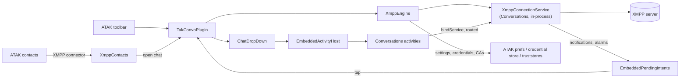

# TAK Convo

An ATAK plugin that embeds the [Conversations](https://codeberg.org/iNPUTmice/Conversations)
XMPP client in ATAK, the way Taktrix embeds Element: Conversations' own engine and screens,
running in ATAK's process, in ATAK panes, connected to the organisation's XMPP server with the
user's TAK identity.

- **XMPP in ATAK**: 1:1 chats and group chats (MUC), OMEMO encryption, file transfer
  (HTTP upload), reactions, search, history (MAM). The engine and UI are Conversations 2.20.4.
- **Zero typing**: the XMPP domain comes from a `.pref` file, a mission package or the MDM that
  installs the plugin (Android app config, e.g. SOTI MobiControl); the login reuses the TAK
  server's username and password. An XMPP login screen exists for other setups.
- **Trust like ATAK**: the server certificate is checked against the CAs of ATAK's TAK server
  truststores (optionally the device CA store, or a CA file), besides the public CAs.
- **TAK identity**: the device's XMPP address goes out in its SA (`<contact xmppUsername>`), as
  TAK Chat does.
- **In ATAK's contacts, like GeoChat**: a TAK user who advertises an XMPP address has an XMPP
  connector in ATAK's contact list that opens the chat in TAK Convo. Unread messages show on the
  contact, on ATAK's Contacts button and on the TAK Convo button. Message notifications are off
  by default, as the Conversations app on the device, signed in to the same account, notifies;
  turned on, they (reply, mark as read) bring ATAK up on the chat when tapped.
- **On ATAK's map**: locations in chats become markers on the map; sharing a location sends
  ATAK's position or a point tapped on the map; MGRS and lat/lon written in messages are links
  to the map; a chat's **Show on map** finds the TAK user. GeoChat-style quick messages can sit
  above the message field (a setting). ATAK's **Send** dialog offers TAK Convo for data packages and files,
  a marker's or shape's Send can go to a group chat, and a received map file can be imported
  into ATAK
  ([docs/10](docs/10-atak-map-integration.md)).

## Status

2026-09-30. Built for ATAK 5.6 and 5.8. Working on a Samsung Galaxy S23 (Android 16) with the
ATAK 5.8.0.5 developer build, against an Openfire server (until the move to 5.6/5.8, also on a
Galaxy S22+ with 5.5.1.8):

| Works | Not yet |
|---|---|
| engine in-process, provisioning from `.pref` or an MDM's app config, TAK credentials or XMPP login | calls (audio/video): switched off, not advertised |
| trust from TAK truststores / Android CA store / CA file | |
| ATAK's map: locations, positions in messages, quick messages, Show on map, Send dialog, import into ATAK | |
| account pane, tool preferences, `.pref` import; QR codes: show and scan; profile picture (from the account pane) | backups |
| chat pane: chat list, chats, group chats, start chat, channel details, search; channel discovery on your XMPP server (setting) | TAK callsigns as the names of other users' XMPP contacts |
| your ATAK callsign is your XMPP nickname, for contacts and in group chats, and follows it (setting); a group chat where someone else has it keeps your nickname there | |
| sending/receiving with OMEMO, reactions, context menus, text selection | |
| the pane follows ATAK's rotation and goes full screen from its handle; the screens are rebuilt for the new size, keeping what they show | |
| attachments: pick, upload, open with another app, camera; voice messages | some Conversations screens are allowed but untested (see docs/04) |
| ATAK contacts: XMPP connector opens the chat, unread counts on contacts and buttons; group chats listed with the users | XMPP presence dots on contacts: implemented, untested with a real second user |
| notifications (a setting, off by default): sound when the pane is closed, tap opens the chat, reply, mark as read; sound and vibration settings | |

Release ATAK (e.g. Play Store ATAK-CAN 5.8) loads only plugins signed by TAK.gov, and its API
is obfuscated, so a plugin for it must be built with that version's SDK and mapping. Until the
plugin goes through TAK.gov signing, it runs on the SDK's developer ATAK (see
[docs/07](docs/07-development-and-testing.md#developer-atak-on-a-test-device-and-release-atak)).

## How it works

ATAK loads a plugin's code into its own process: none of the plugin's activities, services or
providers can run. TAK Convo gives Conversations what it expects anyway:

- **Engine**: `XmppConnectionService` and the `Application` are created as plain objects on an
  `EmbeddedContext` (ATAK's identity, the plugin's resources, storage namespaced in ATAK's data
  directory, `startService`/`bindService` routed to the in-process service).
- **Screens**: Conversations' real activities are created with `Instrumentation.newActivity`,
  driven through their lifecycle by the plugin, and their views moved into an ATAK drop-down.
  A stand-in parent activity catches `startActivity`/`finish` and keeps a back stack. Results,
  permissions, context menus and action modes are routed through ATAK's activity and window.
- **Contacts and notifications**: a `ContactConnectorHandler` for ATAK's XMPP connectors opens
  chats and reports unread counts and presence. Conversations' notifications are posted as
  ATAK's; their taps, actions and alarms are redirected to ATAK's activity and to a receiver in
  ATAK's process, and their icons drawn as bitmaps.
- **Fork**: 30 upstream files changed and one added, all marked `TAKCONVO`: no Android service,
  hooks for trust, compatibility with the libraries ATAK loads, activities in a pane, files
  through ATAK's FileProvider, PendingIntents and notifications that work as ATAK's.



Details in [docs/](docs/README.md).

## Requirements

**Equipment.** Android 6.0+ (minSdk 23). Tested on a Samsung Galaxy S23 (Android 16) and an
Android 14 emulator.

**ATAK.** ATAK 5.6 or 5.8, developer build (the SDK's `atak.apk`). One APK per version, each
built against that version's SDK (ATAK-CAN 5.6.0.24, 5.8.0.5) and the library versions that
ATAK ships (`gradle/atak-runtime.gradle`).

**XMPP server.** Any standards-compliant server. Tested with Openfire (LDAP-backed, SASL PLAIN,
STARTTLS, certificate from an internal CA). Conversations uses MUC, HTTP upload (XEP-0363) and
MAM when the server offers them.

**Network (from the device).**

| Port | Protocol | For |
|---|---|---|
| 53 | DNS (UDP/TCP) | SRV (`_xmpp-client._tcp`, `_xmpps-client._tcp`) and A/AAAA lookups of the XMPP domain |
| 5222 | TCP, XMPP + STARTTLS | client-to-server (or the host/port set in `takconvo_xmpp_host`/`_port`) |
| 5223 | TCP, XMPP over TLS | if the domain's `_xmpps-client` SRV record points there |
| server-defined (Openfire: 7443) | HTTPS | file upload/download (XEP-0363) |
| 443 | HTTPS | only if a user opens "Discover channels" (queries search.jabber.network) |

## Configuration

Settings are ATAK preferences, provisioned by a `.pref` file (alone or in a mission package) or
edited in **Settings › Tool Preferences › TAK Convo**. Minimal provisioning:

```xml
<preferences>
    <preference version="1" name="com.atakmap.app.civ_preferences">
        <entry key="takconvo_xmpp_domain" class="class java.lang.String">xmpp.example.org</entry>
    </preference>
</preferences>
```

The JID becomes `<TAK username>@<domain>` (a TAK username with its own domain, such as a
Windows login `alice@corp.example`, gives `alice@<domain>`). All keys: [provisioning/takconvo-template.pref](provisioning/takconvo-template.pref)
and [docs/03](docs/03-provisioning-and-trust.md).

A `.pref` file can set everything:
- the plugin's settings (`takconvo_xmpp_*`, `takconvo_notification_*`), which are also on its
  settings page;
- an XMPP login (`takconvo_xmpp_username`, `takconvo_xmpp_password`): the password is moved to
  ATAK's encrypted credential store at once;
- Conversations' own settings (`takconvo_conversations_<key>`: OMEMO, read receipts, typing
  notifications, attachment size and compression, message deletion...), whose settings screen
  the plugin's replaces.

A change to where the credentials go (domain, host, port, which credentials and which TAK
server's, trusted CAs) waits for the user's **Connect** in the account pane
([docs/03](docs/03-provisioning-and-trust.md#approving-the-server)): data packages apply their
`.pref` files without asking.

### From an MDM (app config)

An MDM that pushes the APK (SOTI MobiControl, Intune...) can set the same settings as Android
managed configuration: the APK declares them (`res/xml/app_restrictions.xml`), so the console
lists TAK Convo's settings with descriptions. The keys are the preference keys above, plus
`takconvo_xmpp_password` and `takconvo_xmpp_trusted_ca_certificate` (a CA certificate as PEM
text). What the MDM sets:
- is locked: greyed out in the tool preferences, and put back if a `.pref` file changes it;
- needs no approval: the server it sets connects without the user's **Connect**;
- a username and password it sets are used instead of the TAK server credentials;
- applies when ATAK starts or comes back to the front; a key removed from the configuration
  goes back to its default.

Booleans and lists start at **Not managed**. Details:
[docs/03](docs/03-provisioning-and-trust.md#managed-configuration-mdm).

## Build and install

```bash
./gradlew assembleCivDebug --offline                       # for ATAK 5.8
./gradlew assembleCivDebug --offline -PatakVersion=5.6.0   # for ATAK 5.6
java tools/AtakLinkCheck.java <that ATAK SDK>/atak.apk app/build/outputs/apk/civ/debug/<apk>
adb install -r app/build/outputs/apk/civ/debug/<apk>
```

or, on Windows, `tools\deploy.ps1 -Serial <adb serial> [-AtakVersion 5.6.0]`, which also
re-enables the plugin in ATAK after the reinstall and restarts ATAK. See
[docs/07](docs/07-development-and-testing.md) for the setup (`local.properties` with the two
SDKs) and the test checklist.

```bash
tools/check-style.sh                        # line length, wildcard imports, catch-alls
./gradlew testCivDebugUnitTest --offline    # JVM tests of the provisioning and trust logic
```

GitLab's pipeline (`.gitlab-ci.yml`) runs both, the builds and the link checks for both ATAK
versions; its runner needs the ATAK SDKs
([docs/07](docs/07-development-and-testing.md#tests-and-ci)). Gradle checks every downloaded
library against `gradle/verification-metadata.xml`.

These debug builds load in the SDKs' developer ATAK only. For release ATAK (Play Store or an
organisation's), TAK.gov's Third Party Pipeline builds and signs the plugin from source:
`tools/tpp-package.sh` makes one zip per ATAK version (`build/tpp/takconvo-atak56.zip`,
`takconvo-atak58.zip`) to upload there. See
[docs/07](docs/07-development-and-testing.md#release-builds-and-takgovs-third-party-pipeline).

## Findings

What we learned embedding a full Android app in ATAK, roughly in the order it bit us.

**ATAK as a platform**

1. **Release ATAK only loads TAK.gov-signed plugins.** Play Store ATAK-CAN 5.8 logs
   `signature mismatch` and refuses a self-signed plugin whatever its `plugin-api`. Its API is
   also ProGuard-obfuscated (`AtakBroadcast.getInstance()` is `a()`): release plugins are built
   with the SDK's mapping of that exact version. Use the SDK's developer `atak.apk` until the
   plugin goes through TAK.gov signing.
2. **`artifacts.tak.gov` is behind an Appgate SDP gateway.** The build uses the ATAK SDKs
   offline (`atak.sdk.5.6`, `atak.sdk.5.8`). Each ATAK version ships its own AndroidX and
   coroutines versions, which the plugin must compile against: one APK per ATAK version.
3. **A plugin's components never run.** Activities, services, receivers and providers in the
   plugin's manifest are dead: the code runs in ATAK's process, under ATAK's identity. Everything
   Conversations gets from Android had to be supplied by hand ([docs/02](docs/02-embedded-engine.md),
   [04](docs/04-chat-pane-activity-host.md)).
4. **Plugin classes load parent-first.** For any class ATAK also has (AndroidX, OkHttp,
   Kotlin...), ATAK's copy is used. Compile against ATAK's exact versions and don't package
   them (`gradle/atak-runtime.gradle`). This is why OkHttp stays at 4.11 and several AndroidX
   libraries are held back ([docs/06](docs/06-atak-runtime-and-classloading.md)).
5. **ATAK's AndroidX interfaces have no default methods at runtime.** ATAK's R8 build desugared
   them into abstract methods and dropped some companions. Any plugin class implementing them
   must implement every method: a lambda for `OnBackStackChangedListener` crashed ATAK with
   `AbstractMethodError` the moment a chat opened. `tools/AtakLinkCheck.java` finds all such
   cases from the two APKs.
6. **The plugin's `java.time` is `j$.time`** (core library desugaring), so calls into ATAK's
   OkHttp with a `Duration` don't link. Use the `TimeUnit` overloads.
7. **AGP 8 only.** ATAK's `takdev` Gradle plugin needs AGP 8, so compileSdk 36. Upstream
   Conversations 2.20.4 targets SDK 37; its SDK 37 constants moved to `TakConvoCompat`, and
   WebRTC stays at 129.
8. **ATAK drop-downs with `ignoreBackButton`** are kept on ATAK's stack under other drop-downs,
   but back never closes them: `onBackButtonPressed()` is called and the close is refused. The
   pane closes itself when Conversations has nothing left to go back to. A hidden drop-down
   comes back on top with `showDropDown` (`unhideDropDown` unhides the top one only). Other
   drop-downs it opens over are closed unless retained: the account pane has `Pane.RETAIN`.
   ATAK restores a drop-down's view state when it shows again, and an `EditText`'s restored
   text fires its text watchers.
9. **`adb install -r` makes ATAK forget to load the plugin** (`shouldLoad-<package>` is reset,
   Android 16). **Killing ATAK within 10 s of start** leaves `pluginSafeMode` set and ATAK asks
   whether to load plugins. `tools/deploy.ps1` handles both.
10. **ATAK's FileProvider (`<package>.provider`) serves external storage only**, and a plugin
    can't declare its own. Private attachments are served from copies in ATAK's external cache.
11. **ATAK requires camera and microphone at start-up**, so Conversations' permission prompts
    rarely fire; when they do they must go through ATAK's activity.

**Running an app's activities inside another app's window**

12. **`Instrumentation.newActivity` + a stand-in parent works.** Activities attach with
    their own (never shown) window. The parent receives `startActivity`/`finish`, and its window
    gives dialogs ATAK's token. The views are moved into the pane
    ([docs/04](docs/04-chat-pane-activity-host.md)).
13. **Whatever a view asks of its window reaches ATAK's**: context menus came up with
    ATAK's resources (crash on the plugin's string ids) and selections went to ATAK's activity.
    The pane root sends context menus to the embedded activity's own decor view, and gives
    action-mode callbacks a menu inflater with the plugin's resources.
14. **`Activity.requestPermissions` throws in an embedded activity** (no `ActivityThread`).
    Requests go through `ActivityCompat` and a `PermissionCompatDelegate` that asks ATAK's
    `ActivityResultRegistry`. Activity results travel the same way.
15. **Embedded activities must follow ATAK's lifecycle**, not only the pane's visibility:
    a chat left "resumed" behind other apps is marked read and its notifications are held back.
16. **Autofill and content capture must be hidden** from embedded activities: the system server
    rejects sessions for activities it didn't create.
17. **Size resources for the pane, not the screen.** The pane (40 % of the map) is about 325 dp
    wide on a phone. Conversations' attachment grid didn't fit and became a scrolling row.
18. **No `recreate()`**: AppCompat's night-mode switch would recreate the activity; the plugin
    fixes dark mode instead, as ATAK is always dark.
19. **Plugin views outside an AppCompat activity lose Material styling**:
    `MaterialComponentsViewInflater` has to be installed as the inflater factory by hand.
20. **Conversations must not change the process**: its `Application.onCreate` installs Conscrypt
    as the first security provider and a global exception handler. The fork has an embedded
    variant without them.
21. **A plugin's resource id means nothing to an ATAK context.** `Toast.makeText(atak,
    R.string.x, ...)` looks the id up in ATAK's resources and throws
    `Resources$NotFoundException`. The "Not available inside ATAK" toast did that, so every
    unavailable button (the voice message button among them) crashed ATAK. Resolve with the
    plugin's context and pass the text.
22. **Dialog-themed activities can float in the pane.** The voice recorder is shown centred over
    a scrim, and the chat under it stays visible and paused. The `FLAG_KEEP_SCREEN_ON` it sets
    on its unseen window is moved to its views in ATAK's window.
23. **Switch a feature off rather than refuse its screen.** Conversations' call button sends the
    call proposal, and the contact's phone rings, before it opens the call screen. Calls are
    hidden, not advertised and not accepted, reusing upstream's "no calls over Tor" paths.
24. **A phone app's UI is oversized in a side pane.** A lower `densityDpi` in the embedded
    screens' configuration (0.9 × ATAK's) scales all of Conversations' dp and sp at once; only
    the few sizes still out of proportion (avatars, attachment buttons, the input row) were
    changed in the fork.

**Server and provisioning**

25. **Openfire holds a killed client's session detached and doesn't answer a bind for the same
    resource** until it drops it (the new stream idles out after 10 s first). A fresh resource
    on every ATAK start makes login immediate.
26. **TAK server credentials arrive after the plugin starts.** Provisioning re-runs on TAK
    server connection changes and never falls back to another identity in the meantime. With
    several TAK servers, which one connects first changes between starts: the one on the XMPP
    domain is used first (or the one `takconvo_xmpp_tak_server` names), and another one's
    password goes to the XMPP server only after the user's **Connect**.
27. **The organisation's CA is already in ATAK's TAK server truststore**, so reusing it as a
    trust source needs no extra provisioning. `CertificateManager.getLocalTrustManager(String)`
    rebuilds from ATAK's database on each call, so newly imported truststores count.
28. **`.pref` files may carry Booleans as strings**, which breaks preference check boxes; they are
    normalised on load.

**Notifications, alarms and contacts**

29. **Registering as one of Conversations' UI listeners makes it believe it is on screen.** The
    engine did, to follow changes, so Conversations never told the server it was inactive and
    silenced every notification while no chat was open. The fork calls an observer from the same
    places instead ([docs/02](docs/02-embedded-engine.md#changes-and-threads)).
30. **Every PendingIntent aimed at the embedded app's components is silently dropped**:
    notification taps and actions, and all `AlarmManager` alarms, i.e. Conversations' pings and
    reconnection timers. They go through ATAK's activity (its `internalIntent` extra, like ATAK's
    own `NotificationUtil`) and a receiver registered in ATAK's process instead.
31. **An embedded app's notifications are ATAK's.** Resource icons resolve in ATAK's package: a
    random ATAK drawable, or, if the id doesn't exist there, "Bad notification posted", which
    kills ATAK. They are posted with bitmap icons. The system shows them as ATAK's (name, app
    icon on Samsung), and Conversations' notification channels are listed under ATAK.
32. **Shortcuts an embedded app publishes are ATAK's launcher shortcuts**, opening activities ATAK
    doesn't have. Conversations publishes them for frequent contacts; that is off.
33. **ATAK's contacts take plugin handlers per connector type, ahead of their own.** One for
    `connector.xmpp` replaces ATAK's external-app handler; its `NotificationCount` and `Presence`
    features feed the contact rows, and `Contacts.updateTotalUnreadCount()` sets ATAK's Contacts
    and Chat button badges. A plugin's toolbar button is a `NavButtonModel` found by the
    `ToolbarItem`'s identifier, which carries a badge count
    ([docs/08](docs/08-contacts-and-notifications.md)).
34. **A plugin can add its own contacts.** An `IndividualContact` with no map item opens its
    default connector when tapped, takes its unread count from the connector's handler, and
    shows ATAK's chat-room icon with the `fakeGroup` extra. It sits in the root group unless
    `getParentUID()` is overridden, as ATAK's own TADIL-J contacts do. The XMPP group chats are
    listed that way, at the top of the list with the users.
35. **ATAK paints tool icons in one color, from their alpha.** A colored icon shows as a plain
    square in the tool menu. The plugin's app icon (Plugin Manager) is Conversations' launcher
    icon; its tool icon is Conversations' speech bubble (`drawable/ic_takconvo`, from the
    monochrome launcher icon), drawn to a bitmap for the `ToolbarItem`.

**Maintenance**

36. **Every change to Conversations is marked and documented**
    ([docs/05](docs/05-conversations-fork.md)), and `tools/fork-diff.sh` regenerates the exact
    diff against upstream; the doc has the procedure to move to a newer release.
37. **Upstream Conversations has paths longer than 260 characters**: clone it with
    `core.longpaths=true` on Windows or files silently go missing.

**Security**

38. **A `.pref` file can write any preferences file in ATAK**, a plugin's included:
    `PreferenceControl` opens whatever `<preference name>` says. And ATAK applies the `.pref`
    in an imported data package without asking. What decides where credentials go, or proves a
    request is genuine, lives in a file in ATAK's `no_backup/` instead
    ([docs/03](docs/03-provisioning-and-trust.md#approving-the-server)).
39. **Any app can send ATAK's internal broadcasts**: ATAK's launcher activity rebroadcasts the
    `internalIntent` of any intent. Plugin receivers that act use an action with a random part,
    or check a token ([docs/09](docs/09-code-guidelines.md#android)).
40. **Plugins take part in Clear Content through `ClearContentRegistry`**: ATAK calls each
    listener on its clear task's thread, before it clears its own credentials and preferences,
    then quits ([docs/02](docs/02-embedded-engine.md#ataks-clear-content)).
41. **Conversations' OMEMO goes through protobuf-java 2.5.0** (libsignal 2.6.2). Its
    stack-overflow advisory isn't reachable (64 nesting levels at most), but crafted keys parse
    in quadratic time; keys over 2 KiB are skipped
    ([docs/05](docs/05-conversations-fork.md#o-omemo-keys-parsed-by-protobuf-250)).
42. **Only a package reads its own managed configuration** (app config), and a plugin's code
    runs as ATAK: `RestrictionsManager` in ATAK's process returns ATAK's. A provider in the
    plugin's package, in a process of its own, reads it and answers ATAK only. Android tells
    only a running process of the package about changes, so the plugin reads it again each time
    ATAK comes to the front
    ([docs/03](docs/03-provisioning-and-trust.md#managed-configuration-mdm)).
43. **After enrolling for a client certificate, ATAK may keep no TAK server password**: it
    connects with the certificate. A server added by hand keeps what its cache option says
    ("Cache username" keeps only the username), and enrolling with "Use Authentication" off
    keeps the password in memory until ATAK restarts. The XMPP server needs it at each login,
    so TAK Convo asks for it once and keeps it in ATAK's credential store
    ([docs/03](docs/03-provisioning-and-trust.md#a-tak-server-without-its-password)).

## Repository layout

```text
app/                      the ATAK plugin
  src/main/java/com/atakmap/android/takconvo/plugin/
    TakConvoPlugin.java   entry point (IPlugin)
    SensitiveLog.java     debug-only logs that name users
    Guard.java            runs ATAK's callbacks into the plugin without crashing ATAK
    xmpp/                 embedded engine: XmppEngine, EmbeddedContext, CallsignNicknames,
                          PendingIntents, notifications
    contacts/             XmppContacts: ATAK contact handler, unread badges
    config/               XmppSettings, ConversationsSettings, TrustSources, TrustedCa,
                          AppConfig (MDM app config) and its provider
    ui/                   account pane, tool preferences
    ui/host/              chat pane: EmbeddedActivityHost, HostParent, PaneFrame, ChatDropDown
    debug/                DebugReceiver (debug builds)
conversations/            Conversations 2.20.4 fork, as an Android library (GPLv3)
  UPSTREAM.md             base version, imported source sets
  upstream/               upstream manifests and proguard rules, for reference
gradle/atak-runtime.gradle  library versions ATAK provides at runtime
gradle/verification-metadata.xml  checksums of every library the build downloads
provisioning/             .pref template and test files
tools/                    AtakLinkCheck, check-style.sh, fork-diff.sh, deploy.ps1, tpp-package.sh
.gitlab-ci.yml            GitLab pipeline: style, manual, builds, tests, link checks
docs/                     design and maintenance documentation
```

## Documentation

[docs/README.md](docs/README.md): architecture, the embedded engine, provisioning and trust, the
activity host, the Conversations fork, ATAK's runtime, development and testing, ATAK contacts
and notifications, and the code guidelines (error handling, logging, style).

## License

`conversations/` is Conversations by Daniel Gultsch and contributors, GPLv3
([conversations/LICENSE](conversations/LICENSE)). The plugin APK includes it and is distributed
under the GPLv3 ([LICENSE](LICENSE)). The plugin's icons are Conversations' launcher icons. The plugin skeleton
comes from the ATAK-CIV SDK's plugin template.

## Contact

`besteffortdev` on GitHub: <https://github.com/besteffortdev/TAK-Convo>.
