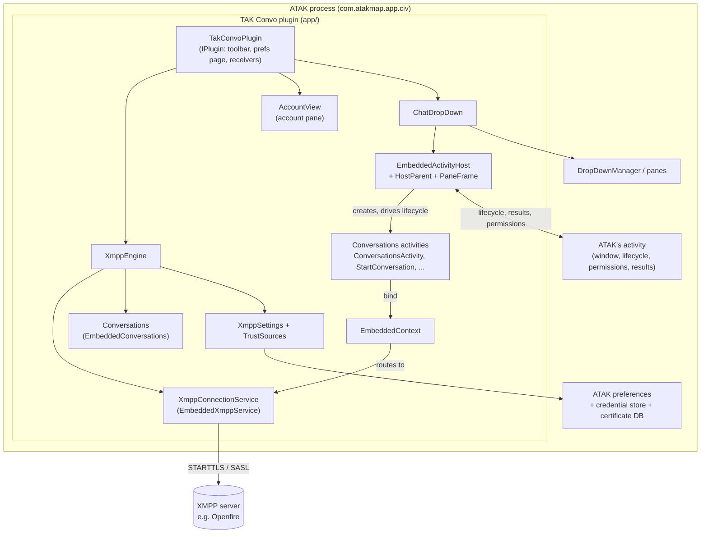

# 01 — Architecture

TAK Convo puts the Conversations XMPP client inside ATAK, the way Taktrix puts Element there:
the engine, the account and the chat screens are Conversations' own code, running in ATAK's
process and shown in ATAK panes.

## The constraint everything follows from

An ATAK plugin is an APK whose code ATAK loads into **its own process** with a class loader of
its own. The plugin package never runs as itself:

- its manifest components (activities, services, receivers, providers) are never started;
- it has no `Application` object and no `ActivityThread` of its own;
- permissions, storage, the process identity, the window and the FileProvider are ATAK's;
- classes that ATAK also contains are loaded **from ATAK** (parent-first class loading).

Conversations is built the opposite way: an `Application`, an `XmppConnectionService` that
Android starts, about forty activities, a FileProvider, a telecom `ConnectionService`. TAK
Convo's job is to give that code what it expects without any of it being real Android
components, and without changing ATAK for everyone else in the process.

## Components



| Component | Package | Role | Doc |
|---|---|---|---|
| `TakConvoPlugin` | `plugin` | ATAK entry point: starts the engine, adds the toolbar button, the tool preferences page and the pane receivers | — |
| `XmppEngine` | `plugin.xmpp` | Creates and drives Conversations' service in-process; provisions the account from settings; advertises the JID in the SA | [02](02-embedded-engine.md) |
| `EmbeddedContext` | `plugin.xmpp` | The `Context` Conversations runs on: ATAK's identity, the plugin's resources, namespaced storage, service routing | [02](02-embedded-engine.md) |
| `EmbeddedConversations`, `EmbeddedXmppService` | `plugin.xmpp` | Upstream's `Application` and `Service` subclasses, attached by hand | [02](02-embedded-engine.md) |
| `XmppSettings`, `TrustSources`, `TrustedCa` | `plugin.config` | What to connect to, with which credentials, trusting which CAs | [03](03-provisioning-and-trust.md) |
| `AccountView`, `ConversationsInflater`, `TakConvoPreferenceFragment` | `plugin.ui` | Account pane (Conversations' `activity_edit_account` layout) and the tool preferences page | [03](03-provisioning-and-trust.md) |
| `EmbeddedActivityHost`, `HostParent`, `PaneFrame`, `ChatDropDown` | `plugin.ui.host` | Run Conversations' own activities, their views shown in an ATAK drop-down | [04](04-chat-pane-activity-host.md) |
| `:conversations` | `eu.siacs.conversations` | Conversations 2.20.4, built as a library, with a small set of marked changes | [05](05-conversations-fork.md) |
| `gradle/atak-runtime.gradle`, `tools/AtakLinkCheck.java` | build | Compile against what ATAK loads at runtime and check for it | [06](06-atak-runtime-and-classloading.md) |
| `DebugReceiver` | `plugin.debug` | Debug builds: drive the plugin from `adb` | [07](07-development-and-testing.md) |

## Lifecycle of the whole thing

```text
ATAK starts, loads the plugin
  TakConvoPlugin.onStart()
    engine = XmppEngine.start(atakContext, pluginContext)   # see 02
        EMBEDDED = true
        build EmbeddedContext, Application, Service; service.onCreate()
        load XmppSettings, install the trust manager, fresh resource per account
        service.onStartCommand()          # connects stored accounts
        provision()                        # create/update the one account from settings
        watch: takconvo_* prefs, TAK server connections, device trust store
    register the tool preferences page and the pane broadcasts
    add the toolbar button

user taps the toolbar button
  showChat()
    no provisioned account  -> account pane (AccountView)
    otherwise               -> ChatDropDown.show(); host.showMain()   # see 04

ATAK stops the plugin (or exits)
  TakConvoPlugin.onStop()
    host.destroy()        # activities stop and unbind from the service first
    XmppEngine.shutdown() # clear the SA advertisement, log out, service.onDestroy()
```

## Threads

Everything the plugin does runs on ATAK's main thread, as upstream's service and activities
expect. Upstream's service calls its listeners from worker threads, so `XmppEngine` posts its
own notifications back to the main thread. The XMPP connection, database, file and crypto work
run on Conversations' own executors, unchanged.

## Data on the device

| What | Where |
|---|---|
| Conversations' database, preferences, files, keys | ATAK's data directory, prefixed: `databases/takconvo_*`, `shared_prefs/takconvo_*`, `files/takconvo/`, `cache/takconvo/` |
| XMPP login (when TAK credentials are not used) | ATAK's encrypted credential store, type `takconvo.xmpp` |
| Settings | ATAK's preferences, keys `takconvo_xmpp_*` |
| Attachments handed to other apps, camera captures | ATAK's external cache: `Android/data/com.atakmap.app.civ/cache/takconvo/{shared,Camera}` (`shared/` is emptied at every start) |
| This device's XMPP address | ATAK preference `saXmppUsername`, which ATAK sends in the self SA as `<contact xmppUsername=...>` |
