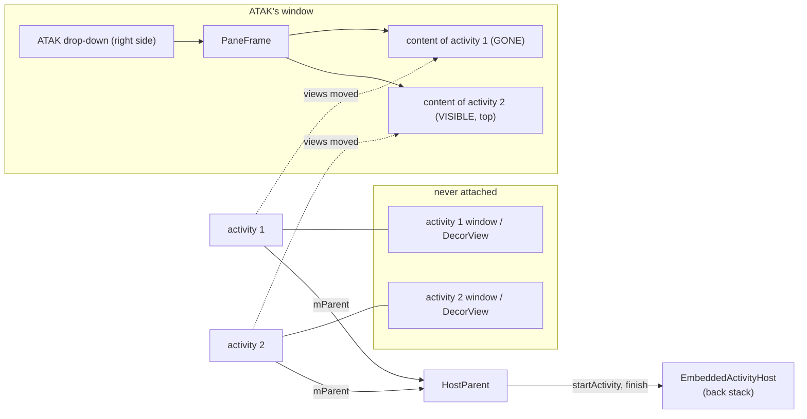

# 04 — The chat pane: Conversations' activities in an ATAK drop-down

The chat list, the chats, contact and channel details, search and so on are **Conversations'
own activities**, unchanged apart from the few fork changes listed at the end. The plugin
creates them itself, drives their lifecycle, and shows their views in an ATAK side pane.

Classes: `plugin/ui/host/EmbeddedActivityHost`, `HostParent`, `PaneFrame`, `ChatDropDown`.

## Why activities can't just be started

`startActivity` asks the system to start a component declared in an installed package's
manifest, in that package's process. The plugin's activities would start in the plugin's own
process: no ATAK, no engine, no map. ATAK's manifest doesn't declare them. So the plugin builds
activity objects the way `ActivityUnitTestCase` and `LocalActivityManager` did:
`Instrumentation.newActivity()` creates and attaches an activity with a window of its own,
`Instrumentation.callActivityOn*()` drives its lifecycle. The activity's window is **never
shown**: its views are moved into the pane.



## Creating an activity

```text
EmbeddedActivityHost.create(className, intent, caller, requestCode):
    attachToAtak()                               # lifecycle observer + permission delegate
    cls  = pluginClassLoader.loadClass(className)
    base = engine.newUiContext(display, paneConfiguration())    # see "configuration"
    info = ActivityInfo(package = ATAK, name = className, theme = Theme.Conversations3,
                        flags = HARDWARE_ACCELERATED)
    intent.component = (ATAK package, className)
    activity = instrumentation.newActivity(cls, base, token = null, engine.application,
                                           intent, info, title = "", parent = hostParent,
                                           id = className, lastNonConfigurationInstance = null)
    activity.setTheme(info.theme)
    stack.push(Record(activity, caller, requestCode))   # before onCreate: it may start or finish
    instrumentation.callActivityOnCreate(activity, null)
    instrumentation.callActivityOnPostCreate(activity, null)
    record.content = takeContent(activity)
    paneFrame.addView(record.content, MATCH_PARENT)

takeContent(activity):
    view = activity.window.decorView.findViewById(android.R.id.content)
    climb while the parent is AppCompat's FitWindowsLinearLayout / FitWindowsFrameLayout /
          ActionBarOverlayLayout                   # keeps the action-mode bar containers
    detach view from its parent
    if view has no background: view.background = activity's windowBackground
    activity.embeddedContent = view                # fork: BaseActivity.findViewById looks here
    return view
```

The window itself stays unattached. Attaching an activity's decor view to ATAK's window would
reconfigure ATAK's view root.

## The parent activity

Android still routes what a child activity can't do itself through its **parent**, as it did
for `ActivityGroup`. `HostParent` is an `Activity` that is never attached or shown. It only
answers those calls:

| Call on the child | Goes to the parent as | `HostParent` does |
|---|---|---|
| `startActivity`, `startActivityForResult` | `startActivityFromChild` | `host.startFromChild(child, intent, requestCode)` |
| `finish()` | `finishFromChild` | `host.finishFromChild(child)` |
| window creation | `getWindow()` (container) | ATAK's window, so the child's dialogs and popups get ATAK's window token |
| theme creation | `getTheme()` | an empty theme, so only the activity's own style applies |
| `setRequestedOrientation` | same | ignored: the orientation is ATAK's |
| `startIntentSender...` | same | not supported |

## The back stack

```text
startFromChild(child, intent, requestCode):
    post { start(record of child, intent, requestCode) }   # after the caller's callback:
                                                            # it often finishes right after
start(caller, intent, requestCode):
    name = intent.component.className
    if name not in Conversations' package:  startExternal(...); return
    if name is EditAccountActivity / ManageAccountActivity:  listener.onShowAccount(); return
    if name is ui.activity.SettingsActivity:                  listener.onShowSettings(); return
    if name not in SUPPORTED:
        toast "Not available inside ATAK"; deliver RESULT_CANCELED to caller; return
    existing = record of that class on the stack
    if existing and (name in SINGLE_INSTANCE or intent has FLAG_ACTIVITY_CLEAR_TOP):
        destroy every record above existing
        pause(existing); onNewIntent(existing, intent); settle(existing)
        return
    pause(top)
    record = create(name, intent, caller, requestCode)    # on failure: toast, cancel, settle(top)
    settle(record)
    previous.content.visibility = GONE; stop(previous)

finishFromChild(child):       # marks it finishing, then posts:
    finish(record):
        stack.remove(record); destroy(record)
        deliverResult(record.caller, record.requestCode,
                      activity.mResultCode, activity.mResultData)   # read by reflection
        if record was on top:
            next = top()
            if next == null: listener.onHostEmpty()     # -> close the pane
            else: next.content.visibility = VISIBLE; settle(next)
```

`SUPPORTED` lists the activities allowed to open in the pane:

| Tested on a device | Allowed, not yet tested |
|---|---|
| `ConversationsActivity`, `StartConversationActivity`, `ConferenceDetailsActivity`, `SearchActivity` | `ContactDetailsActivity`, `TrustKeysActivity`, `AddReactionActivity` (the full emoji picker; quick reactions are a dialog and work), `MucUsersActivity`, `ChooseContactActivity`, `ChannelDiscoveryActivity`, `EditHistoryActivity`, `MediaBrowserActivity`, `BlocklistActivity` |

A failure in `onCreate` is caught (toast, `RESULT_CANCELED`); a failure later, e.g. in a click
handler, would still crash ATAK, so test an activity before relying on it.
`ConversationsActivity` and `StartConversationActivity` are `SINGLE_INSTANCE`, like upstream's
`singleTask`/`singleTop`.

### Other apps and results

Intents for other apps (file picker, camera, "open with") are started by **ATAK's** activity,
the only one the system can return a result to:

```text
startExternal(caller, intent, requestCode):
    if no caller or requestCode < 0:  atak.startActivity(intent); return
    launcher = atak.activityResultRegistry.register("takconvo#" + n, StartActivityForResult) {
        result -> unregister; deliverResult(caller, requestCode, result.code, result.data)
    }
    launcher.launch(intent)
    # ActivityNotFoundException / SecurityException -> toast, deliver RESULT_CANCELED

deliverResult(to, requestCode, code, data):
    if to is still on the stack and not finishing:
        data.extrasClassLoader = plugin class loader
        to.activity.onActivityResult(requestCode, code, data)       # protected: reflection
```

`ComponentActivity.onActivityResult` dispatches the result to its own `ActivityResultRegistry`,
so fragments that launched with `registerForActivityResult` get it as usual.

## Lifecycle

An embedded activity is resumed only while it is on top, the pane is visible, **and ATAK is
resumed**. Conversations marks what a resumed chat shows as read and holds back its
notifications, so a chat must not stay resumed behind other apps.

```text
settle(record):                      # called on every change of any of the three
    atakState = atak.lifecycle.currentState       # ATAK's activity is a LifecycleOwner
    if paneVisible and atakState >= RESUMED:  resume(record)
    elif paneVisible and atakState >= STARTED: pause(record); start(record)
    else:                                       stop(record)

resume(r): start(r); callActivityOnResume; onPostResume (reflection, resumes fragments);
           lifecycle ON_RESUME
pause(r):  lifecycle ON_PAUSE; callActivityOnPause
start(r):  [callActivityOnRestart if stopped before]; callActivityOnStart; lifecycle ON_START
stop(r):   pause(r); lifecycle ON_STOP; callActivityOnStop
destroy(r): stop(r); lifecycle ON_DESTROY; callActivityOnDestroy; remove r.content
```

Instrumentation doesn't make the calls around `onStart`/`onResume`/`onStop` that update an
activity's own `LifecycleRegistry`, so the host dispatches those events itself. Dispatching
one that already happened does nothing.

Inputs: `ChatDropDown.onDropDownVisible/onDropDownClose` → `setVisible()`; a
`LifecycleEventObserver` on ATAK's activity → `settleTop()`. Closing the pane only stops the
activities; they are destroyed when the plugin stops.

## Back

```text
ChatDropDown.onBackButtonPressed():  goBack(); return true
goBack():
    if not host.onBackPressed(): closeDropDown()

host.onBackPressed():
    if top.activity.onBackPressedDispatcher.hasEnabledCallbacks():
        dispatcher.onBackPressed(); return true     # fragments, search bar, attachments...
    if stack.size > 1: finishFromChild(top); return true
    return false                                     # nothing left: close the pane
```

The drop-down is shown with `ignoreBackButton = true`. ATAK then keeps it on its stack when
another drop-down opens over it (e.g. the account pane), and brings it back afterwards. The
catch: with that flag ATAK calls `onBackButtonPressed()` but **never closes** the drop-down on
its own. So `goBack()` closes it explicitly: `closeDropDown()` passes the flag and does close.

## Views that talk to their window: `PaneFrame`

The pane's root, `PaneFrame`, is in ATAK's window. Some requests a view makes of its window
travel up the view tree and would reach **ATAK's** decor view, which answers them with ATAK's
resources and ATAK's activity as callback:

```text
PaneFrame.dispatchApplyWindowInsets(insets): return insets       # already clear of the bars

PaneFrame.showContextMenuForChild(view[, x, y]):
    # e.g. long-press on a message. ATAK's decor view would build the menu with ATAK's
    # resources (Resources$NotFoundException on the plugin's string ids, ATAK crashes) and
    # deliver the selection to ATAK's activity.
    return top.activity.window.decorView.showContextMenuForChild(view[, x, y])
    # that decor view is unattached, but its menu callback is the embedded activity and its
    # context has the plugin's resources; the popup/dialog anchors to `view`, which is attached

PaneFrame.startActionModeForChild(view, callback[, type]):
    # e.g. text selection, "Paste as quote". The floating toolbar must stay with ATAK's
    # window, the one on screen, but callbacks inflate their menus with mode.getMenuInflater()
    return super.startActionModeForChild(view, InflatingCallback(view.context, callback)[, type])

InflatingCallback(context, callback) extends ActionMode.Callback2:
    every callback method passes InflatingActionMode(mode, context) instead of mode
InflatingActionMode(mode, context) extends ActionMode:
    getMenuInflater()      -> new MenuInflater(context)          # plugin resources
    setTitle/Subtitle(res) -> mode.setTitle(context.getText(res))
    everything else        -> mode
```

## Runtime permissions

`Activity.requestPermissions()` starts the system's permission activity through the
activity's `ActivityThread`, which an embedded activity doesn't have: it throws a
`NullPointerException`. The fork routes Conversations' requests through
`ActivityCompat.requestPermissions`, which asks a global `PermissionCompatDelegate` first. The
host installs one while it has activities:

```text
attachToAtak():
    previous = ActivityCompat.getPermissionCompatDelegate()
    ActivityCompat.setPermissionCompatDelegate(delegate)

delegate.requestPermissions(activity, permissions, requestCode):
    if activity is not on the stack: return previous?.requestPermissions(...) ?: false
    launcher = atak.activityResultRegistry.register(key, RequestMultiplePermissions) {
        granted -> unregister
                   results[i] = granted[permissions[i]] ? GRANTED : DENIED
                   activity.onRequestPermissionsResult(requestCode, permissions, results)
    }
    launcher.launch(permissions)
    return true

detachFromAtak(): if the delegate is still ours, put `previous` back
```

Fragments and `registerForActivityResult(RequestPermission...)` end up in
`ActivityCompat.requestPermissions` too, and `onRequestPermissionsResult` dispatches back to
them. In practice ATAK already holds the permissions Conversations asks for (ATAK requires
camera and microphone at start-up), so this path is a safety net. It was checked with a
request for `READ_CONTACTS` (undeclared by ATAK → denied) together with `CAMERA` (granted).

## Configuration and theme

```text
paneConfiguration():
    uiMode = NIGHT_YES                                   # ATAK is always dark
    if pane size is known:
        screenWidthDp, screenHeightDp = pane size / density
        smallestScreenWidthDp = min(...); orientation from the pane's shape
```

Resources are chosen for the **pane's** size, not the screen's, so a half-screen pane on a
tablet gets Conversations' phone layouts. On a 480 dpi phone in landscape a half-width pane is
about 350 × 330 dp. The host also sets `AppCompatDelegate.setDefaultNightMode(MODE_NIGHT_YES)`,
because AppCompat would otherwise follow the device and an embedded activity can't
`recreate()`. That setting is process-wide: it would also affect another AppCompat plugin in
ATAK.

The configuration is fixed when an activity is created: resizing the pane or rotating the
device lays the views out again but doesn't re-select resources.

## Files handed to other apps

"Open with", "share" and the camera need a `content://` URI that another app can read or
write. A plugin can't declare a `FileProvider`; ATAK's (`com.atakmap.app.civ.provider`) serves
external storage only. The fork's `FileBackend` handles it (see
[05](05-conversations-fork.md#f-files-handed-to-other-apps)):

```text
getUriForFile(context, file):                   # embedded
    return FileProvider.getUriForFile(context, "<ATAK package>.provider", shareableFile(file))

shareableFile(file):
    if file is under external storage or /storage: return file
    copy = externalCache/shared/<path relative to filesDir>   # same file -> same URI
    if copy is missing or older or of another size: copy file -> copy
    return copy

Cache.takePicture():   the camera writes to externalCache/Camera when embedded
XmppEngine start:      FileBackend.deleteShareableCopies()   # decrypted copies don't linger
```

The copies are in ATAK's app-specific external storage, which other apps can only read
through the provider's grant.

## What the fork changes for this

| Fork change | Why |
|---|---|
| `BaseActivity.embeddedContent`, `findViewById`, `getCurrentFocus` | the views are no longer below the window's decor view |
| `BaseActivity.onStart` skips the night-mode check | it calls `recreate()` |
| `Activities.setStatusAndNavigationBarColors` does nothing | the system bars are ATAK's |
| `ConversationsActivity.onBackendConnected` skips start-up prompts | crash reports, battery optimisation and permissions are ATAK's business |
| `requestPermissions` → `ActivityCompat.requestPermissions` | see "Runtime permissions" |
| attachment choices in one scrolling row | the pane is too narrow and low for the grid |
| `FileBackend` provider and camera | see "Files handed to other apps" |

## Not available yet

Started from Conversations' UI, these show "Not available inside ATAK": voice recording
(`RecordingActivity`), calls (`RtpSessionActivity`), share/show location, QR code scanning,
profile pictures, Conversations' own settings (replaced by the plugin's), backup import.
Dialog-themed activities would fill the pane rather than float.
