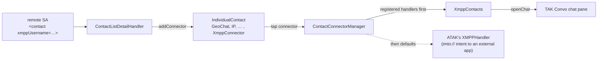

# 08 — ATAK contacts, unread badges and notifications

TAK Convo joins ATAK's contacts the way GeoChat does:

- a TAK user who advertises an XMPP address gets an **XMPP connector** in ATAK's contact list.
  Tapping it opens the chat with that address in TAK Convo's pane;
- the open **XMPP group chats** are contacts too, at the top of ATAK's contact list next to
  "All Chat Rooms", so that it has both the users and the group chats, as with TAK Chat;
- the connector shows that chat's **unread count**, which ATAK adds to the contact's row and to
  its Contacts and Chat buttons. It also shows the address's **XMPP presence**;
- the **TAK Convo toolbar button** shows Conversations' total unread count;
- Conversations' own **notifications** work inside ATAK: tapping one brings ATAK to the front
  and opens the chat, and the Reply and Mark as read actions work.

Classes: `plugin/contacts/XmppContacts`, `XmppRoomContact`, `plugin/xmpp/EmbeddedPendingIntents`,
`plugin/xmpp/EmbeddedNotifications`, `TakConvoPlugin` (`openChat`, `showChat(Intent)`).
Fork changes: [05](05-conversations-fork.md), section G.

## How ATAK's contacts work



- When an SA carries `<contact xmppUsername="...">`, ATAK's `ContactListDetailHandler` adds an
  `XmppConnector` (type `connector.xmpp`, address = the advertised JID) to the contact. This
  device advertises its own address the same way (see [02](02-embedded-engine.md)).
- `ContactConnectorManager` asks the handlers registered with `addContactHandler` before its
  built-in ones. The built-in XMPP handler starts an `imto://jabber/<address>` intent for an
  external app; registering ours replaces it without touching ATAK.
- A handler can offer **features** per connector. ATAK uses two of them for its lists:
  `NotificationCount` (an `Integer`) and `Presence` (a `Contact.UpdateStatus`).
  `IndividualContact.getUnreadCount()` is the sum of its connectors' counts; the contact row
  draws the default connector's icon with its count and a presence-colored dot.
- `Contacts.updateTotalUnreadCount()` makes ATAK recount (at most every 2 s, on its own thread),
  redraw the rows, and set the badge of its **Contacts** and **Chat** buttons.
- A contact's default connector is its only one, else the one last used, else the one of
  highest priority. `XmppConnector` has priority 2, GeoChat 1: a TAK user who advertises an
  XMPP address is reached over XMPP by default.

## XmppContacts

One object is the connector handler, the engine listener, and the owner of the toolbar badge.
ATAK asks for features on its UI thread and on its unread-count thread, so they are answered
from immutable snapshots, rebuilt on the main thread when Conversations reports a change.

```text
XmppContacts.start():                            # TakConvoPlugin.onStart, after the engine
    CotMapComponent.contactConnectorMgr.addContactHandler(this)
    NavButtonManager.addModelListChangedListener(-> updateToolbar)   # our button may come later
    engine.addListener(this); refresh()

onXmppStateChanged():                            # coalesced by XmppEngine, see 02
    debounce 300 ms: refresh()

refresh():                                       # main thread
    account = engine.account                     # the provisioned one only
    unread   = { key(c.address) -> c.unreadCount()
                 for c in open conversations of account, 1:1 and group chats, if unread > 0 }
    presence = { key(contact.address) -> status(contact.shownStatus)
                 for contact in account.roster if we're subscribed to its presence (TO) }
             + { key(room.address) -> joined ? CURRENT : DEAD  for each open group chat }
    syncRooms({ room.address -> room.name for each open group chat })
    if a snapshot or a room contact changed: Contacts.updateTotalUnreadCount()
    updateToolbar(engine.unreadCount)            # Conversations' own total

key(jid) = bare JID, lower case                  # advertised addresses may differ in case

status(availability):                            # ATAK's dot colors
    CHAT, ONLINE    -> CURRENT (green)
    AWAY, XA, DND   -> STALE   (yellow)
    OFFLINE         -> DEAD    (red)
    not subscribed  -> null    (no dot: we don't know, which isn't "offline")

isSupported(type)   = type == "connector.xmpp"
hasFeature(f)       = f in {NotificationCount, Presence}
getFeature(NotificationCount, uid, address) = unread[key(address)] ?: 0
getFeature(Presence, uid, address)          = presence[key(address)]

handleContact(type, uid, address):               # UI thread: the connector was tapped
    if address isn't a JID: toast "Not a valid XMPP address"
    else: plugin.openChat(address)
    return true                                  # never fall back to the external-app handler

updateToolbar(count):
    model = NavButtonManager.getModelByReference(pluginPackageName)  # the ToolbarItem's id
    if model and model.badgeCount != count: model.badgeCount = count; notifyModelChanged(model)
```

The toolbar button's `NavButtonModel` is found by the `ToolbarItem`'s identifier, the plugin's
package name: `ATAKUIService.addToolbarItem` uses it as the model's reference. The button is
added asynchronously, hence the model-list listener.

```text
TakConvoPlugin.openChat(address):
    host = openChatPane()                        # null without an account: account pane shows
    conversation = engine.openConversation(address)   # findOrCreateConversation(account, bare JID)
    host.showConversation(conversation.uuid)
```

XMPP users who aren't TAK users don't appear in ATAK's contacts; they are in Conversations'
own chat list.

### Group chats

A group chat has no TAK user, so the plugin adds a contact of its own for each open one
(private group chats and channels alike), the way ATAK adds its TADIL-J contacts:

```text
XmppRoomContact(name, address) extends IndividualContact:
    uid = "takconvo.room:" + address
    connectors = { XmppConnector(address) }     # handled above: tap opens it, unread, presence
    extras.fakeGroup = true                      # ATAK's chat room icon ("All Chat Rooms")
    getDefaultConnector() = the XMPP connector
    # parent: the root group, where IndividualContact puts every contact

syncRooms(open):                                 # main thread, from refresh()
    remove the contacts of the rooms no longer open      # Contacts.removeContact
    add a contact per new room to the root group; rename the ones whose name changed
```

They are listed directly in the contact list, not in a group of their own: a group of them
was one tap further for the thing users look for most.

Tapping a room's contact (or its connector) goes through `handleContact` like a user's:
`engine.openConversation(address)` finds the open group chat by its address before it would
create anything. Its unread count shows on its row and adds to the Contacts button. The
contacts exist only while the plugin runs; `stop()` removes them.

## Notifications

Conversations' `NotificationService` decides **when** to notify, and that logic is kept as it
is: not for the open chat, silently while the chat list is on screen, not for messages caught
up after a login (backlog), not during the grace period after you wrote from another device,
not for muted chats. What changed is **how** a notification reaches the system, because it is
posted as ATAK's.

| Problem when posted as ATAK's | Fix | Where |
|---|---|---|
| Conversations believed it was always on screen (the engine was a UI listener) and silenced every notification when no chat was open | the engine observes through `TakConvoCompat.Observer` instead | [02](02-embedded-engine.md#changes-and-threads) |
| Tapping went to `ConversationsActivity`, which ATAK doesn't have: nothing happened | ATAK's activity with an `internalIntent`, like ATAK's `NotificationUtil` | `EmbeddedPendingIntents.getActivity` |
| Reply, Mark as read and dismissing went to `XmppConnectionService`: nothing happened | a broadcast to a receiver in ATAK's process, handed to the engine | `EmbeddedPendingIntents.getService` |
| Icons are resource ids, looked up in ATAK's package: the status bar showed a random ATAK drawable, and a missing one crashes the posting app ("Bad notification posted") | bitmaps drawn from the plugin's resources | `EmbeddedNotifications` |
| Conversations' "foreground service" notification ("1 of 1 accounts connected") was posted as a plain notification on error-state changes | never posted embedded; a stale one is cancelled at start | fork, `XmppConnectionService` |
| Messages published conversation shortcuts: ATAK's launcher would have listed XMPP contacts that open nothing | shortcuts are not published embedded | fork, `ShortcutService`, `NotificationService` |

### A tap

```text
EmbeddedPendingIntents.getActivity(...)          # see 02, PendingIntents
system: starts ATAKActivity (CLEAR_TOP | SINGLE_TOP), ATAK comes to the front
ATAKActivity.onNewIntent: AtakBroadcast.send(internalIntent)          # ACTION_OPEN

TakConvoPlugin, on ACTION_OPEN:
    intent = EmbeddedPendingIntents.unwrapActivity(broadcast)   # e.g. ConversationsActivity,
                                                                #   VIEW_CONVERSATION, uuid
    host = openChatPane()
    host.startActivity(intent)          # routed like any activity start: the chat, or the
                                        # account pane for the error notification (EditAccount)
    if the host shows nothing: close the pane
```

When ATAK is not running, the tap starts ATAK but the chat doesn't open: ATAK only reads
`internalIntent` in `onNewIntent`.

### An action

```text
EmbeddedPendingIntents.getService(...) -> broadcast "takconvo://deliver/<class>/<action>"
system: sends it (with the typed reply as clip data, for Reply)
receiver: intent = copy(received), action and component restored
          engineContext.startService(intent)   # -> XmppConnectionService.onStartCommand
          # upstream then does what it always does: sends the reply, marks the chat read, ...
```

The receiver lives while the engine does. After ATAK is killed, actions of notifications left
in the shade do nothing.

### Icons

```text
EmbeddedNotifications.filter(n):                 # TakConvoCompat.filter, in notify()
    if n's small icon and action icons are not resource icons: return n
    b = Notification.Builder.recoverBuilder(atak, n)
    b.setSmallIcon(bitmap(n.smallIcon.resId))
    b.setActions(each action rebuilt with bitmap(action.icon.resId), same intent, inputs, extras)
    return b.build()                             # on failure: null, and nothing is posted

bitmap(resId):                                   # cached per id
    drawable = pluginResources.getDrawable(resId, Theme.Conversations3)   # tints use theme attrs
    tint white (the status bar uses only the alpha), draw at 24 dp -> Icon.createWithBitmap
```

A bitmap works whatever package posts it. A resource icon of the plugin package
(`Icon.createWithResource(pluginPackage, id)`) would need the system UI to load another
package's resources, which isn't guaranteed.

### What remains ATAK's

- Samsung (and some other skins) show the posting app's name and icon on a notification:
  **ATAK**. The avatar and the text are Conversations'.
- Conversations' notification channels (Messages, Silent messages, Connectivity problems, ...)
  are channels of ATAK and appear in ATAK's notification settings, next to ATAK's own.
- Conversations' per-contact "Custom notifications" need conversation shortcuts, which are off.
- ATAK's Chat button badge counts XMPP unread messages from TAK users too: ATAK sets the same
  total on its Contacts and Chat buttons.

## Testing

Debug builds only; see [07](07-development-and-testing.md#debug-broadcasts). Nothing is sent to
anyone: the fake contact is an SA handled by this ATAK only (its internal dispatcher), and fake
messages are stored locally as received. Both default to this device's own address, so opening
the contact's chat opens the self chat.

```bash
B="adb shell am broadcast -a com.atakmap.android.takconvo"
$B.DEBUG_FAKE_CONTACT --es callsign XMPPTest        # a TAK user advertising our own JID
$B.DEBUG_FAKE_INCOMING --es body Hello             # an unread message in the self chat
$B.DEBUG_DUMP_CONTACT                              # log: unread, XMPP unread, presence, default
$B.DEBUG_ATAK_BROADCAST --es action com.atakmap.android.contact.CONTACT_LIST   # open Contacts
$B.DEBUG_OPEN_CONTACT                              # what tapping the XMPP connector does
$B.DEBUG_REMOVE_FAKE_CONTACT
```

Tested on the Samsung (ATAK 5.5.1.8, Android 16), 2026-09-30 (the group chats in Contacts also
on 5.8.0.5):

- the fake contact's row shows the XMPP connector as default with a red **1**; the Contacts
  button shows **1**; tapping the connector opens the self chat in the pane and clears both;
- the TAK Convo tool shows the total in the Tools menu;
- with the pane closed: a heads-up notification in the `messages` channel, bitmap icon,
  Conversations switched to the background (`csi/inactive`); with the chat list shown: silent
  (`silent_messages`); with the chat open: none;
- tapping the notification brings ATAK up with the chat open; Reply sends (to the self chat)
  and Mark as read clears the notification and the badges;
- the post-connectivity-change alarm reaches `SystemEventReceiver` and the engine pings.

Not tested yet: presence dots (the fake contact advertises our own JID, whose presence we don't
subscribe to), the error notification's tap to the account pane, and a real second TAK user.

Group chats, tested on the Samsung 2026-09-30: Contacts lists `team-room` with ATAK's chat
room icon, the XMPP connector and a green dot (joined); tapping it opens the group chat in the
pane. A group chat's unread count on its contact wasn't
tested: that takes a message from someone else in the room.
