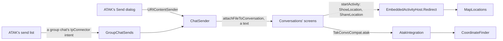

# 10 — ATAK map integration

What ties the chats to ATAK's map and data, beyond the contacts of
[08](08-contacts-and-notifications.md):

| Feature | The user sees |
|---|---|
| Locations on the map | a location opened from a chat becomes a marker on ATAK's map, which centers on it |
| Sharing a location | the attachment row's **Location** sends ATAK's own position, or a point tapped on the map |
| Positions in messages | MGRS grid references and latitude/longitude written in a message are links to the map |
| Quick messages | when turned on in the settings, a row of preset buttons above the message field, like GeoChat's; a tap adds the text to the message |
| Show on map | in a one-to-one chat with a TAK user, the chat menu's **Show on map** centers the map on that user |
| TAK Convo in the Send dialog | ATAK's **Send** (data packages, exported files) offers TAK Convo, then a chat |
| Map items to a group chat | a marker's or shape's **Send** lists the group chats among the contacts; the chat gets a line naming it, with its MGRS, and a data package of it |
| Import into ATAK | a received data package, KML/KMZ, GPX, CoT, GeoJSON or imagery file can be imported instead of opened elsewhere |
| The map's contact menu | the XMPP button of a TAK user's contact sub-menu opens the chat ([08](08-contacts-and-notifications.md)) |

Classes: `plugin/map/MapLocations`, `AtakIntegration`, `CoordinateFinder`, `ChatSender`;
`plugin/contacts/GroupChatSends`, `XmppRoomContact`; `ui/host/EmbeddedActivityHost` (its
`Redirect`). Fork changes: [05](05-conversations-fork.md),
section M. All of it starts in `TakConvoPlugin.startMapIntegration()` and stops with the plugin.

## How each part reaches Conversations

Conversations keeps doing what it does; the plugin answers at three places:



- **Activity starts.** The host asks its `Redirect` about every start before anything else
  ([04](04-chat-pane-activity-host.md)). `MapLocations` takes Conversations'
  `ShowLocationActivity` and `ShareLocationActivity`, which can't run embedded (they show an
  osmdroid map), and answers the caller as they would.
- **`TakConvoCompat.ATAK`** (`TakConvoCompat.Atak`): what the chat screens ask of ATAK, set by the
  plugin. Unset outside ATAK, where the fork behaves as upstream.
- **ATAK's `URIContentManager`**: `ChatSender` is a send method like "Contact" or "Select Server".
- **ATAK's send list**: the group chats' contacts have an IP connector naming a send intent,
  which `GroupChatSends` receives.

## Locations

```text
MapLocations.start(caller, intent, result):           # EmbeddedActivityHost.Redirect
    ShowLocationActivity  -> show(intent)
    ShareLocationActivity -> share(caller, result)
    anything else         -> not ours

show(intent):
    position = extras latitude/longitude              # a location message (GeoHelper)
            or the geo: URI's                         # a geo: link, the preview before sending
    label    = extra "label" (the sender, "Me")       # fork: GeoHelper adds it
            or the geo: URI's q=lat,lon(label)        # a position written in a message: its text
    marker   = map item "takconvo-location-<lat>,<lon>" (5 decimals)  # one per position
            or PlacePointTool.MarkerCreator(position).type(b-m-p-s-m)  # spot map marker
                   .callsign(label or "Location").showCotDetails(false).placePoint()
    MapTouchController.goTo(marker)

share(caller, result):
    dialog "Share a location": My position | A point on the map
    My position:        ATAKUtilities.findSelf(mapView) -> its point, CE as accuracy
    A point on the map: ATAK's MapClickTool, prompt "Tap the point to share";
                        its callback broadcast carries the point
    result: RESULT_OK with latitude, longitude[, accuracy]  # what ShareLocationActivity returns
            RESULT_CANCELED without a position or when the dialog is cancelled
```

Conversations makes a `geo:` URI of the result and sends it as a location message: any XMPP
client shows it. The markers are ordinary local spot map markers: they stay until deleted and
are sent to no one unless the user sends them.

## Positions written in messages

`MessageAdapter` calls `TakConvoCompat.linkCoordinates(body)` after its own linkifier. Each
position `CoordinateFinder` finds becomes a `geo:lat,lon?q=lat,lon(<the text>)` link, unless a
link covers it already. A tap goes through `FixedURLSpan` to `ShowLocationActivity`, so to
`MapLocations`, and the marker is named after the text.

| Written as | Example | Rule |
|---|---|---|
| MGRS | `18T VR 44690 31520`, `18TVR4469031520` | zone 1-60 and band, 100 km square, 1-5 digits each for easting and northing (as two groups or together, even count); decoded by ATAK's `MGRSPoint` |
| signed decimal degrees | `45.4215, -75.6972` | at least 3 decimals each: fewer would match ordinary numbers |
| hemisphere letters | `45.30N 75.88W`, `45.30° N, 75.88° W` | at least 2 decimals |

Spaces can be of any kind, with invisible format characters (`\p{Z}`, `\p{Cf}`): ATAK's MGRS
has a left-to-right mark before each space (see "Map items to a group chat"). Positions outside
-90..90 / -180..180 are ignored, and so are overlapping matches.

## Quick messages

`ConversationFragment.onResume()` fills the row (`quick_messages`, a `ChipGroup` in a
`HorizontalScrollView` above the message field) from `AtakIntegration.quickMessages()`:

```text
takconvo_show_quick_messages       # ATAK preference, false by default
    false   -> no row
takconvo_quick_messages            # ATAK preference, texts separated by |
    missing -> Roger|Wilco|Say again|In position|Moving|All secure
    empty   -> no row
tap: appends the text to the message field (after a space), cursor at the end
```

Like GeoChat's buttons they fill the field; the user still taps send. The row is off by
default: it takes a line of the pane's height. Turned on and edited in the tool preferences
(Chat › Show quick messages, Quick messages) or a `.pref` file
([03](03-provisioning-and-trust.md)); a change shows the next time a chat opens.

## Show on map

The chat menu's **Show on map** (`action_show_on_map`) is visible in a one-to-one chat when
`AtakIntegration.isOnMap(address)`:

```text
find(address):
    own address -> ATAKUtilities.findSelf(mapView)      # the self chat: your position
    else        -> the map item whose meta "xmppUsername" equals it, ignoring case
                   # ContactListDetailHandler sets it from <contact xmppUsername> in SA
showOnMap: MapTouchController.goTo(item), or the toast "Not on the map" if it has gone
```

The menu is built when the chat's toolbar is refreshed, so a TAK user who appears or leaves
afterwards changes it at the next refresh.

## TAK Convo in ATAK's Send dialog

```text
ChatSender (URIContentSender):
    name "TAK Convo", the tool icon
    isSupported(uri): an account, and file:// (exports, files) or mpm:// (data packages)
    sendContent(uri):
        dialog "Send to": the account's chats that aren't archived, most recent first;
            group chats marked "(group chat)", the address added to names two chats share
        file://  -> the file
        mpm://   -> the data package's zip; a package built from a selection exists only as a
                    manifest: MissionPackageFileIO.save() first
        XmppConnectionService.attachFileToConversation(chat, file:// uri, null)
            # copies the file, uploads it (HTTP upload), encrypted when the chat is
        opens the chat in the pane; ATAK's callback gets the outcome
```

ATAK's Send dialog appears from the Data Packages list (SEND), after an export (Overlay
Manager › Export › Send), and elsewhere ATAK sends files.

## Map items to a group chat

A marker's or shape's **Send** (its radial menu or details) doesn't use the Send dialog: it
opens ATAK's contact list in send mode (`ContactPresenceDropdown.SEND_LIST`, with the item's
`targetUID`), where the user picks contacts and taps Send. ATAK sends CoT to each, over the
network. That list only shows contacts with an IP connector, and a contact's IP connector may
name an intent to broadcast instead (`IpConnector(String sendIntent)`, ATAK's hook for
plugins). The group chats' contacts ([08](08-contacts-and-notifications.md#group-chats)) have
one:

```text
XmppRoomContact:
    connectors: XmppConnector(address)                          # open, unread, presence
                IpConnector("com.atakmap.android.takconvo.SEND_TO_GROUP_CHAT")
    FOVFilter.Filterable: always accepted                       # not on the map, so never
                                                                #   hidden by "in view" filters

ATAK, Send to a group chat: broadcasts a copy of the send request with that action and
    contactUID = "takconvo.room:<address>"                      # one per group chat picked

GroupChatSends (receiver of that action):
    chat = the account's open group chat with that address, or a toast
    MissionPackageManifest extra (a data package sent to contacts) -> ChatSender.sendDataPackage
    targetUID / targetsUID (map items)                            -> ChatSender.sendMapItems
    filename (a file)                                             -> ChatSender.sendFile
    anything else (bare CoT events from a plugin, a GeoChat text) -> toast "can't send this"

ChatSender.sendMapItems(items, chat):                            # as ATAK does in GeoChat
    1. a text: "Rally point · 18T VR 30500 17000" (one item with a position), or
               "3 map items: a, b, c"
    2. a data package of the items: MissionPackageApi.CreateTempManifest(name, import on
       receipt), addMapItem(uid) each, saved, then uploaded like any file
```

The text reads well in any XMPP client, and in TAK Convo its MGRS is a link to the map. The
data package carries the items as they are (type, icon, remarks, shape points): a TAK Convo
user imports it with a tap, as any received map file. TAK users picked in the same list still
get the CoT from ATAK, as before.

ATAK writes MGRS with a left-to-right mark (U+200E) before each space. The text sent has plain
spaces, and `CoordinateFinder` treats any space or invisible format character as a space, so
coordinates copied from ATAK into a message are found too.

## Import into ATAK

`ViewUtil.view()` asks `TakConvoCompat.atak().openFile(...)` before handing a received file to
another app:

```text
openFile(context, file, openElsewhere):
    extension in zip, dpk, kml, kmz, gpx, cot, geojson, tif, tiff, ntf, nitf, mbtiles, sqlite?
        no  -> false: opened as usual
        yes -> dialog "Received ZIP file": Import into ATAK | Open with another app
               Import: AtakBroadcast USER_HANDLE_IMPORT_FILE_ACTION
                       filepath, showNotificationsDuringImport, zoomToFile
               # ATAK copies the file, sorts it (data package, KML, ...) and imports it
```

Conversations names received files by message id, so the dialog shows the type, not the name. A
data package's contents keep their names (the manifest's).

## Testing

Tested on the S23 (ATAK 5.8.0.5), 2026-10-02, in the self chat (debug broadcasts in
[08](08-contacts-and-notifications.md#testing) for the fake messages and TAK user):

- a fake message `Rally at 18T VR 44690 31520 or 45.4215, -75.6972` and one with
  `18TVR3050017000 and 45.30N 75.88W`: all four are links; each tap put a marker named after the
  text and centered the map on it;
- the quick message row showed the defaults; Roger then Wilco gave "Roger Wilco"; a `.pref`
  value `Contact|Need medevac` showed those two; a blank value hid the row;
- Location › A point on the map: ATAK's prompt, a tap, the preview; tapping the preview made a
  "Location" marker; sent, then **Show location** on the message centered the map on it;
- Show on map: the self chat centered on the self marker; a fake TAK user advertising another
  address centered on its marker; its contact sub-menu's XMPP button opened its chat;
- Data Packages › SEND: the dialog listed TAK Convo; the self chat received the 2 KiB package
  (OMEMO); tapping it, **Import into ATAK** extracted its 2 items into ATAK.

Map items to a group chat, on the S23 the same day: a marker's details › SEND listed
`team-room` among the contacts (nothing was sent: it is a shared room). The same content,
through the debug broadcast `DEBUG_SEND_MAP_ITEM --es uid <marker>` to the self chat: the line
`Location · 18T VR 30688 17052` (OMEMO), its MGRS a link, and a 1 KiB data package. That test
found the U+200E marks: before the fix, the MGRS in the line wasn't a link.

Not tested: **Open with another app** in the import dialog (upstream's path, unchanged), the
address shown for two chats of the same name, a real second TAK user, and the last step of a
group chat send (ATAK's broadcast reaching `GroupChatSends`), which needs a group chat that
can take test messages.

## Not done

- Publishing the position over XMPP (XEP-0080), or XMPP users on the map: positions already go
  through the TAK server.
- CoT over XMPP: no other XMPP client understands it.
- ATAK emergency alerts forwarded to a room: safety-critical, it needs its own design.
- Several sets of quick messages to switch between, as GeoChat has.
